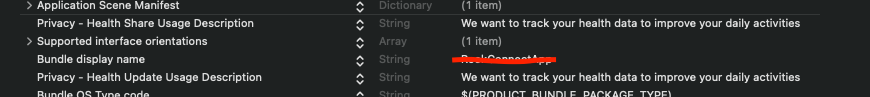
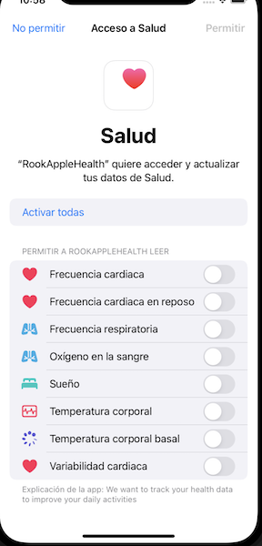

# RookWatchSDK

Rook Watch SDK for watchOS enables fetch health data from apple health and synchronize it with rook server. It also enables to register a new user and store it locally.

The SDK provides access to apple health data, however, is enabled only after the user's explicit consent. The user can select detailed data sharing settings including witch data type will be read.

## Features

The features listed bellow are available to fetch and synchronize:

- Sleep summaries
- Physical summaries
- Body summaries
- Heart rate events
- Oxygenation events
- Activity events
- Time zone of the device

## Installation

To add a package dependency to your Xcode project, select File > Swift Packages > Add Package Dependency and enter the repository URL [rook Watch SDK]()

## Configuration

To configure Rook SDK, you need to follow this steps:

1. Import the apple health sdk

```swift
import RookSDK
```

2. Add your credentials. 
 - This method should be called at the beginning of your app's launch process.

```swift
func application(_ application: UIApplication
                 didFinishLaunchingWithOptions launchOptions: [UIApplication.LaunchOptionsKey : Any]? = nil) -> Bool {
    
    RookWatchConnectConfigurator.shared.setConfiguration(
      clientUUID: "YOUR-CLIENT-UUID",
      secretKey: "YOUR-SECRET-KEY")
      
    RookWatchConnectConfigurator.shared.setEnvironment(.sandbox)
    
    RookWatchConnectConfigurator.shared.initRook()
    return true
}
```

3. Add the HealthKit framework to your Xcode project:

- Open your project in Xcode.
- Click on your project file in the Project Navigator.
- Select your target and then click on the "Signing and Capabilities" tab.
- Click on the "+" and select "HealthKit.framework" from the list.


4. Then declare the privacy permissions used by this SDK. You will need to include the NSHealthShareUsageDescription and NSHealthUpdateUsageDescription keys in your app's Info.plist file. These keys provide a description of why your app needs to access HealthKit data and will be displayed to the user in the permission request dialog.

```text
<key>NSHealthShareUsageDescription</key>
<string>This app requires access to your health and fitness data in order to track your workouts and activity levels.</string>
<key>NSHealthUpdateUsageDescription</key>
<string>This app requires permission to write health data to HealthKit.</string>
```



### Configuration

RookWatchConnectConfigurator Use this class to configure and init the sdk.
This class conforms the singleton pattern, to access this class use the shared property.

| Method | Description |
| ----- | ----- |
| `func setConfiguration(clientUUID: String, secretKey: String)` | Sets the configuration of the sdk. |
| `func setEnvironment(_ environment: RookEnvironment)`| Configures the rook sdk environment. |
| `func initRook()` | Initializes the rook sdk |
| `func updateUserId(_ id: String, completion: @escaping (Result<Bool, Error>) -> Void)` | It will try to register the user in the rook server and it will be stored, if the registration was successful, after that the sdk upload the current time zone of the device. |
| `func clearUser(completion: @escaping (Result<Bool, Error>) -> Void)` | Deletes the user stored locally. |
| `func syncUserTimeZone(completion: @escaping (Result<Bool, Error>) -> Void)`| Uploads the current time zone of the device a user has to added before use this method. |

### Permissions

Before synchronize or fetch health date the user has to grand access, the sdk provides `RookPermissionExtraction` class to request user's permission. It contains the methods described bellow:

| Method | Description |
| ----- | ----- |
|  + requestAllPermissions(completion: @escaping (Result<Bool, Error>) -> Void)| Sends a request for all the health permissions and displays a view to grand access |
| + requestSleepPermissions(completion: @escaping (Result<Bool, Error>) -> Void) | Sends a request for the sleep data types permissions and displays a view to grand access. |
| + requestUserInfoPermissions(completion: @escaping (Result<Bool, Error>) -> Void) | Sends a request for the user information permissions. |
| + requestPhysicalPermissions(completion: @escaping (Result<Bool, Error>) -> Void) | Sends a request for the physical data types permissions and displays a view to grand access |
| + requestBodyPermissions(completion: @escaping (Result<Bool, Error>) -> Void) | Sends a request for the body data type permissions and displays a view to grand access. |

After call any of the above methods a pop up view will display.

**Note: this view only appear if is the first time the user ask for permissions after that the user is able to change the permission in the settings app**



### User

Before synchronize summaries or events a user have to be added, otherwise the sdk will return an error.

The class `RookWatchConnectConfigurator` contains two methods related to the user access.

| Method | Description |
| ----- | ----- |
| `func updateUserId(_ id: String, completion: @escaping (Result<Bool, Error>) -> Void)` | It will try to register the user in the rook server and it will be stored, if the registration was successful, after that the sdk upload the current time zone of the device. |
| `func clearUser(completion: @escaping (Result<Bool, Error>) -> Void)` | Deletes the user stored locally. |
| `public func syncUserTimeZone(completion: @escaping (Result<Bool, Error>) -> Void)` | Uploads the current time zone of the device a user has to added before use this method. |

### SyncSummaryManager

This class contains the methods to synchronize summaries of the user

| Method | Description |
| ----- | ----- |
| `func syncSleepSummary(form date: Date, completion: @escaping (Result<Bool, Error>) -> Void)` | Synchronizes the sleep summary from the given date. |
| `func syncPhysicalSummary(form date: Date, completion: @escaping (Result<Bool, Error>) -> Void)` | Synchronizes the physical summary from the given date. |
| `func syncBodySummary(from date: Date, completion: @escaping (Result<Bool, Error>) -> Void)` | Synchronizes the body summary from the given date. |
| `func getSummaryLastDateSync(of type: LastSummaryDateSyncType, completion: @escaping (Result<Date,Error>) -> Void)`| Returns the last date of a summary was uploaded. |

### SyncEventsManager

| Method | Description |
| ----- | ----- |
| `func syncBodyHeartRateEvent(date: Date, completion: @escaping (Result<Bool, Error>) -> Void)` | Synchronized all the body heart rate events from the given date. |
| `func syncPhysicalHeartRateEvent(date: Date, completion: @escaping (Result<Bool, Error>) -> Void)` | Synchronized all the physical heart rate events from the given date. |
| `func syncBodyOxygenationEvent(date: Date, completion: @escaping (Result<Bool, Error>) -> Void)` | Synchronized all the body oxygenation events from the given date. |
| `func syncPhysicalOxygenationEvent(date: Date, completion: @escaping (Result<Bool, Error>) -> Void)` | Synchronized all the physical oxygenation events from the given date. |
| `func syncTrainingEvent(date: Date, completion: @escaping (Result<Bool, Error>) -> Void)` | Synchronized all the trainings events from the given date. |
| `func getEventLastDateSync(of type: LastEventDataSyncType, completion: @escaping (Result<Date, Error>) -> Void)` | Return the last date of a event was uploaded. |

### Retrieving data

#### RookExtractionManager

To retrieve any type of summary, you need to provide a date. This date should not be the current day

To get health data, create a instance of the class `RookAHExtractionManager` that contains the following methods

| Method | Description |
| ------ | ----------- |
| getSleepSummary(date: Date, completion: @escaping (Result<RookSleepData?, Error>) -> Void) | Retrieves in the completion block the sleep data of the user or an error. |
| getPhysicalSummary(date: Date, completion: @escaping (Result<RookPhysicalData, Error>) -> Void) | Retrieves in the completion block the physical data of the user or an error. |
| getBodySummary(date: Date, completion: @escaping (Result<RookBodyData, Error>) -> Void) | Retrieves in the completion block the body data of the user or an error. |
| getUserInformation(date: Date, completion: @escaping (Result<RookUserInfoData, Error>)) | Retrieves in the completion block the user information data or an error. |
| getLastExtractionDate(of summary: RookDataType) -> Date? | Returns the last date extraction of the summary |
| getUserTimeZone(completion: @escaping (Result<RookUserTimeZone, Error>) -> Void) | Retrieves in the completion block the current user's time zone or an error. |

For example, if you want to get yesterday's sleep summary, call `getSleepSummary`. It will return a `RookSleepData` instance or return an error.

```swift
let extractionManager: RookAHExtractionManager = RookAHExtractionManager()

func getSleepSummary() {
  let date: Date = Date()
  extractionManager.getSleepSummary(date: date) { result in

    switch (result) {
      case .success(let data):
        if let data = data {
          debugPrint("sleep data \(data)")
        }
      case .failure(let error):
        debugPrint("error while fetching sleep \(error)")
    }

  }

}

```
#### RookExtractionEventManager

The Access point all the event health data managed by RookAppleHealth.

**Note: All the data introduced manually in apple health container, will be ignored.**

Use `RookPermissionExtraction` object to request permission to read  health data from Health kit.
Once permission is granted, you can use the `RookExtractionManager` to fetch all events data

`RookExtractionEventManager`contains the methods listed bellow:

| Method | Description |
| ------ | ----------- |
| `getPhysicalHeartRateEvents(date: Date, completion: @escaping(Result<[RookHeartRateEvent],Error>) -> Void)` | Returns `[RookHeartRateEvent]` an array of objects with all the data of the heart rate events while the user was in a physical activity |
| `public func getBodyHeartRateEvents(date: Date, completion: @escaping(Result<[RookHeartRateEvent],Error>) -> Void)` | Returns `[RookHeartRateEvent]` an array of objects with all the data of the heart rate events while the user was not in a physical activity |
| `public func getPhysicalOxygenationEvents(date: Date, completion: @escaping(Result<[RookOxygenationEvent],Error>) -> Void)` | Returns `[RookOxygenationEvent]` an array of objects with all the data of the oxygenation events while the user was in a physical activity |
| `public func getBodyOxygenationEvents(date: Date, completion: @escaping(Result<[RookOxygenationEvent],Error>) -> Void)` | Returns `[RookOxygenationEvent]` an array of objects with all the data of the oxygenation events while the user was not in a physical activity |
| `public func getActivityEvents(date: Date, completion: @escaping (Result<[RookActivityEvent], Error>) -> Void)` | Returns `[RookActivityEvent]` an array of objects with all the data of the activity events |


### Keeping track of the last time a summary was retrieved

To help you retrieve the data of the days the user did not open your app. We store in preferences the last date data was retrieved from (even if that attempt resulted in no data being found).

